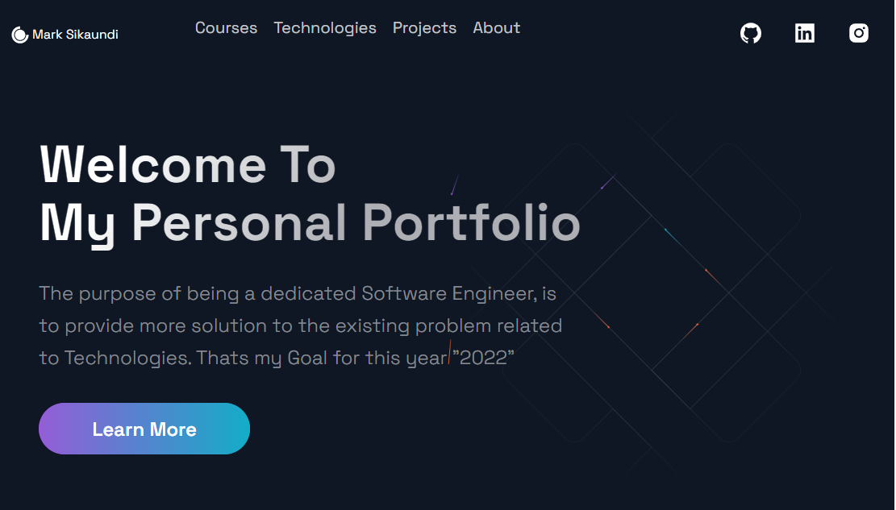

## Personal Portfolio

### [Live Site] Check below




This is a code repository for the corresponding video tutorial. Your portfolio is your resume and your business card.

In this video, we will create a full Personal Development Portfolio. We're going to use React and Next.js.

# Setup: install node modules
- npm install
# To the project use
- npm run dev```
